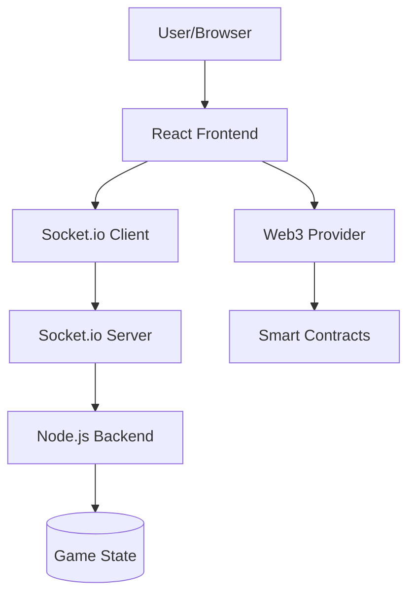

# Functional Flow Analysis: Web3 Poker Application

## **High-Level Application Architecture**



---

## **Frontend Application Flow**

### **1. Application Bootstrap**
```javascript
// Entry Point: client/src/index.js
ReactDOM.render(
  <React.StrictMode>
    <Providers>      // Wraps entire app with contexts
      <App />
    </Providers>
  </React.StrictMode>
)
```

### **2. Provider Hierarchy**
```javascript
// client/src/components/Providers.js
<GlobalProvider>           // Global state (wallet, user data)
  <WebSocketProvider>      // Socket.io connection management
    <GameProvider>         // Game state (tables, players, hands)
      <Router>             // React Router for navigation
        <Routes />
      </Router>
    </GameProvider>
  </WebSocketProvider>
</GlobalProvider>
```

### **3. Context State Management**

#### **Global Context** (global)
```javascript
// GlobalState.js - Manages:
const globalState = {
  walletAddress: null,        // Connected wallet
  user: null,                 // User profile
  tables: [],                 // Available poker tables
  players: [],                // Online players
  setWalletAddress: func,     // Wallet connection handler
  setTables: func,            // Update tables list
  setPlayers: func            // Update players list
}
```

#### **Socket Context** (websocket)
```javascript
// WebsocketProvider.js - Manages:
const socketState = {
  socket: null,               // Socket.io instance
  socketId: null,             // Unique connection ID
  connectionState: 'disconnected', // Connection status
  // Event handlers for socket lifecycle
}
```

#### **Game Context** (game)
```javascript
// GameState.js - Manages:
const gameState = {
  currentTable: null,         // Active table data
  playerCards: [],            // Player's hole cards
  communityCards: [],         // Board cards
  currentBet: 0,              // Current bet amount
  gamePhase: 'waiting',       // preflop/flop/turn/river
  joinTable: func,            // Join table action
  sitDown: func,              // Sit at specific seat
  makeAction: func            // Bet/call/fold actions
}
```

---

## **Component Flow Architecture**

### **1. Route-Based Navigation**
```javascript
// client/src/components/routing/Routes.js
<Switch>
  <Route path="/" exact component={Home} />
  <Route path="/connect-wallet" component={ConnectWallet} />
  <Route path="/play" component={Play} />
  <Route path="/table/:tableId" component={Table} />
</Switch>
```

### **2. Page Component Flow**

#### **Home Page** (`client/src/pages/Home/`)
```javascript
// Functionality:
- Display available tables
- Show online player count
- Wallet connection status
- Navigation to game areas

// Socket Events Used:
- CS_FETCH_LOBBY_INFO (outgoing)
- SC_RECEIVE_LOBBY_INFO (incoming)
```

#### **ConnectWallet Page** (ConnectWallet)
```javascript
// Flow:
1. Initialize socket connection
2. Emit CS_FETCH_LOBBY_INFO
3. Handle wallet connection (Web3)
4. Set emergency bypass if needed
5. Navigate to /play

// Key Functions:
useEffect(() => {
  // Socket connection testing
  const socketAvailable = socket || window.socket
  if (socketAvailable) {
    setConnectionAttempted(true)
    // Get URL parameters or create test data
    const testWalletAddress = 'test_wallet_' + Math.random()
    setWalletAddress(testWalletAddress)
    
    // Emit lobby info request
    socketAvailable.emit(CS_FETCH_LOBBY_INFO)
    navigate('/play')
  }
}, [socket, navigate, query, setWalletAddress])
```

#### **Play Page** (`client/src/pages/Play/`)
```javascript
// Flow:
1. Check socket connection
2. Verify wallet address
3. Join default table (table ID: 1)
4. Render table UI or redirect

// Key Logic:
useEffect(() => {
  const activeSocket = socket || window.socket
  if (activeSocket && walletAddress) {
    console.log('Joining table with wallet:', walletAddress)
    joinTable(1) // Join table 1 by default
  } else if (!walletAddress) {
    navigate('/')
  }
}, [socket, walletAddress, joinTable, navigate])
```

---

## **Backend Application Flow**

### **1. Server Initialization**
```javascript
// server.js
const express = require('express')
const http = require('http')
const socketIo = require('socket.io')

const app = express()
const server = http.createServer(app)
const io = socketIo(server, {
  cors: { origin: "*" }  // CORS configuration
})

// Initialize socket event handlers
require('./socket')(io)

server.listen(7777)
```

### **2. Socket Event Architecture**
```javascript
// socket/index.js - Main event handler
io.on('connection', (socket) => {
  console.log('Client connected:', socket.id)
  
  // Store socket reference globally
  socket.player = null
  socket.tableId = null
  
  // Event Handlers:
  socket.on('CS_FETCH_LOBBY_INFO', handleLobbyInfo)
  socket.on('CS_JOIN_TABLE', handleJoinTable)
  socket.on('CS_SIT_DOWN', handleSitDown)
  socket.on('CS_MAKE_ACTION', handlePlayerAction)
  socket.on('disconnect', handleDisconnect)
})
```

### **3. Game State Management**

#### **Table Management**
```javascript
// socket/index.js - Table structure
const tables = {
  1: {
    id: 1,
    name: "Table 1",
    maxPlayers: 6,
    players: [],           // Array of player objects
    gameState: 'waiting',  // waiting/playing/showdown
    pot: 0,
    communityCards: [],
    currentBet: 0,
    activePlayer: null
  }
}
```

#### **Player Management**
```javascript
// Player object structure
const player = {
  id: socket.id,
  walletAddress: 'wallet_address',
  username: 'player_name',
  chips: 1000,
  cards: [],             // Hole cards
  bet: 0,                // Current bet
  position: 0,           // Seat number
  isActive: true,
  hasActed: false
}
```

---

## **Socket Event Flow**

### **1. Lobby Information Flow**
```javascript
// Frontend → Backend
CS_FETCH_LOBBY_INFO

// Backend Processing:
const handleLobbyInfo = (socket) => {
  const lobbyData = {
    tables: Object.values(tables),
    players: getAllConnectedPlayers(),
    totalPlayers: connectedPlayers.length
  }
  
  socket.emit('SC_RECEIVE_LOBBY_INFO', lobbyData)
}

// Backend → Frontend
SC_RECEIVE_LOBBY_INFO: { tables, players, totalPlayers }
```

### **2. Table Joining Flow**
```javascript
// Frontend → Backend
CS_JOIN_TABLE: { tableId: 1 }

// Backend Processing:
const handleJoinTable = (socket, data) => {
  const { tableId } = data
  const table = tables[tableId]
  
  if (table && table.players.length < table.maxPlayers) {
    // Create player object
    const player = createPlayer(socket)
    
    // Add to table
    table.players.push(player)
    socket.tableId = tableId
    socket.player = player
    
    // Broadcast updated table state
    io.emit('SC_TABLE_UPDATED', table)
  }
}

// Backend → All Clients
SC_TABLE_UPDATED: { table data }
```

### **3. Game Action Flow**
```javascript
// Frontend → Backend
CS_MAKE_ACTION: { action: 'bet', amount: 100 }

// Backend Processing:
const handlePlayerAction = (socket, data) => {
  const { action, amount } = data
  const table = tables[socket.tableId]
  const player = socket.player
  
  // Validate action
  if (validateAction(player, action, amount)) {
    // Process action
    processPlayerAction(table, player, action, amount)
    
    // Update game state
    updateGameState(table)
    
    // Broadcast to all players at table
    io.to(`table_${table.id}`).emit('SC_GAME_UPDATED', {
      table,
      lastAction: { player: player.id, action, amount }
    })
  }
}
```

---

## **Web3 Integration Flow**

### **1. Wallet Connection**
```javascript
// client/src/hooks/useWalletConnection.js
const connectWallet = async () => {
  if (window.ethereum) {
    const accounts = await window.ethereum.request({
      method: 'eth_requestAccounts'
    })
    
    setWalletAddress(accounts[0])
    
    // Listen for account changes
    window.ethereum.on('accountsChanged', handleAccountsChanged)
  }
}
```

### **2. Smart Contract Integration**
```javascript
// client/src/utils/contractInteraction.js
const gameContract = new ethers.Contract(
  CONTRACT_ADDRESS,
  CONTRACT_ABI,
  provider
)

// Example: Deposit chips to game contract
const depositChips = async (amount) => {
  const tx = await gameContract.deposit({
    value: ethers.utils.parseEther(amount.toString())
  })
  
  await tx.wait()
  // Update local chip balance
}
```

---

## **Data Flow Patterns**

### **1. Real-time Game Updates**
```javascript
// Pattern: Server → All Table Players
io.to(`table_${tableId}`).emit('SC_GAME_UPDATED', gameState)

// Frontend handling:
useEffect(() => {
  socket?.on('SC_GAME_UPDATED', (gameState) => {
    setCurrentTable(gameState.table)
    setGamePhase(gameState.phase)
    setCommunityCards(gameState.communityCards)
  })
}, [socket])
```

### **2. User Action Validation**
```javascript
// Frontend validation:
const makeAction = (action, amount) => {
  if (validateLocalAction(action, amount)) {
    socket.emit('CS_MAKE_ACTION', { action, amount })
  }
}

// Backend validation:
const handlePlayerAction = (socket, data) => {
  if (validateServerAction(socket.player, data)) {
    processAction(data)
  } else {
    socket.emit('SC_ACTION_ERROR', 'Invalid action')
  }
}
```

### **3. State Synchronization**
```javascript
// Periodic state sync to prevent desync
setInterval(() => {
  Object.values(tables).forEach(table => {
    io.to(`table_${table.id}`).emit('SC_SYNC_STATE', table)
  })
}, 30000) // Every 30 seconds
```

---

## **Error Handling Flow**

### **1. Connection Recovery**
```javascript
// WebsocketProvider.js
useEffect(() => {
  const handleReconnect = () => {
    console.log('Socket reconnected')
    // Re-emit join table if user was in game
    if (currentTable) {
      socket.emit('CS_JOIN_TABLE', { tableId: currentTable.id })
    }
  }
  
  socket?.on('connect', handleReconnect)
}, [socket, currentTable])
```

### **2. Game State Recovery**
```javascript
// Backend: Handle player reconnection
const handleReconnection = (socket) => {
  // Find player's previous table
  const playerTable = findPlayerTable(socket.id)
  if (playerTable) {
    // Rejoin table
    socket.join(`table_${playerTable.id}`)
    socket.emit('SC_GAME_STATE_RECOVERY', playerTable)
  }
}
```

---

## **Performance Optimizations**

### **1. Frontend Optimizations**
```javascript
// Memoized components to prevent unnecessary re-renders
const TableComponent = React.memo(({ table }) => {
  // Only re-render when table data actually changes
})

// Debounced socket events
const debouncedAction = debounce((action) => {
  socket.emit('CS_MAKE_ACTION', action)
}, 300)
```

### **2. Backend Optimizations**
```javascript
// Event batching for multiple updates
const batchUpdates = (tableId) => {
  clearTimeout(updateTimers[tableId])
  updateTimers[tableId] = setTimeout(() => {
    const table = tables[tableId]
    io.to(`table_${tableId}`).emit('SC_TABLE_UPDATED', table)
  }, 100)
}
```

This functional flow demonstrates how the poker application maintains real-time synchronization between multiple clients while handling complex game state, user actions, and Web3 integration in a scalable architecture.