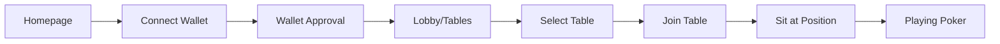
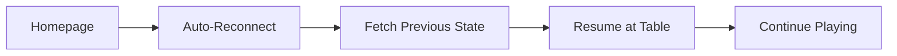
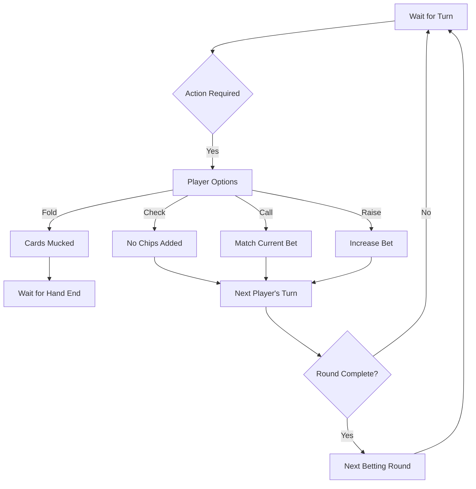
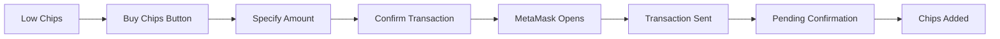
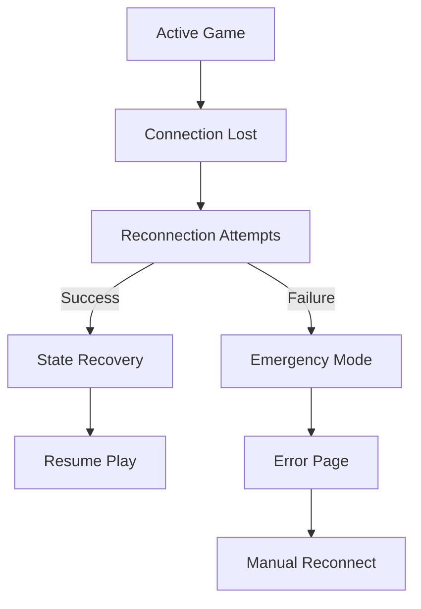
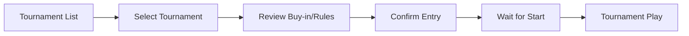

# User Journey Breakdown: Web3 Poker Application

## 1. **First-Time User Journey**

### **Entry Point → Playing Poker**

### **Technical Flow**
1. **Homepage (`/`):**
   - App initializes contexts (GlobalProvider, WebSocketProvider, GameProvider)
   - User sees connect wallet button
   - Socket connection attempted in background

2. **Connect Wallet (`/connect-wallet`):**
   - `WebSocketProvider` establishes connection to backend
   - `CS_FETCH_LOBBY_INFO` event sent to get available tables
   - MetaMask popup requests wallet connection
   - `setWalletAddress()` updates GlobalContext

3. **Lobby/Tables View:**
   - `SC_RECEIVE_LOBBY_INFO` event populates table list
   - User sees available tables, player counts, and blinds

4. **Table Selection & Join:**
   - User clicks "Join Table"
   - `joinTable(tableId)` function from GameContext
   - `CS_JOIN_TABLE` event sent to backend
   - `SC_TABLE_UPDATED` received with current players

5. **Sit at Position:**
   - User selects empty seat
   - `sitDown(seatId)` function triggered
   - `CS_SIT_DOWN` event sent to backend
   - `SC_PLAYER_SAT` event updates all players' UI

6. **Playing:**
   - Game UI shows cards, chips, and action buttons
   - User can now participate in poker hands

### **Failure Points & Recovery**
- Wallet connection fails → Emergency bypass timer (4-5 seconds)
- Socket connection fails → Connection state tracking with retry
- Table full → Error message and return to lobby

---

## 2. **Returning User Journey**

### **Entry Point → Resume Playing**

### **Technical Flow**
1. **Homepage Reload:**
   - App checks localStorage/cookies for previous session
   - Wallet reconnection attempted automatically
   - `WebSocketProvider` reestablishes connection

2. **State Recovery:**
   - `CS_FETCH_LOBBY_INFO` retrieves tables
   - Backend checks for player's previous table
   - If found, auto-rejoins previous table

3. **Resume Playing:**
   - Table state synchronized via `SC_GAME_UPDATED`
   - Player's cards and chips restored
   - UI shows current game state

### **Edge Cases**
- Session expired → Treated as new user
- Game ended while away → Redirected to lobby
- Wallet changed → Prompt to confirm new wallet

---

## 3. **Active Gameplay Journey**

### **Betting Round Flow**

### **Technical Flow**
1. **Waiting for Turn:**
   - `SC_GAME_UPDATED` events update UI as others act
   - Current player highlighted on table
   - Timer may show countdown for action

2. **Player's Turn:**
   - `SC_PLAYER_ACTION_REQUIRED` received
   - Action buttons enabled (Fold/Check/Call/Raise)
   - Betting slider activated if raising

3. **Taking Action:**
   - User selects action (e.g., raise to 100 chips)
   - `makeAction('raise', 100)` function called
   - `CS_MAKE_ACTION` event sent to backend
   - Backend validates action and updates game state
   - `SC_GAME_UPDATED` broadcasts new state to all players

4. **Betting Round Completion:**
   - When all players have acted, round advances
   - New community cards may be dealt
   - `SC_CARDS_DEALT` event updates the board
   - New betting round begins

5. **Hand Completion:**
   - At showdown, `SC_SHOWDOWN` event reveals all cards
   - `SC_HAND_COMPLETE` announces winner(s)
   - Pot distributed to winner(s)
   - Brief pause before next hand

### **In-Game Events**
- **Timeout Protection:** Auto-fold/check if player doesn't act
- **Chat Messages:** Sent via separate socket events
- **Multi-Way Pots:** UI shows side pots when necessary

---

## 4. **Wallet-Related Journeys**

### **Buying Chips Flow**

### **Technical Flow**
1. **Initiate Purchase:**
   - User clicks "Buy Chips" button
   - Modal opens with amount selector

2. **Blockchain Transaction:**
   - `depositChips(amount)` function called
   - Web3 provider (MetaMask) opens
   - User confirms transaction with gas fee
   - Transaction hash returned

3. **Waiting for Confirmation:**
   - UI shows "Transaction Pending"
   - Backend listens for blockchain event
   - Once confirmed, `SC_CHIPS_UPDATED` event sent
   - Chip balance updated in UI

### **Cashing Out Flow**
- Similar to buying, but reversed (`withdrawChips()`)
- Backend verifies player not in active hand
- Chips converted to crypto and sent to wallet

---

## 5. **Error Recovery Journeys**

### **Connection Loss Flow**

### **Technical Flow**
1. **Detection:**
   - Socket `disconnect` event triggered
   - `connectionState` set to 'disconnected'
   - UI shows connection status indicator

2. **Automatic Recovery:**
   - WebSocketProvider attempts reconnection
   - Upon success, `CS_RECONNECT` event sent with player ID
   - Backend sends `SC_GAME_STATE_RECOVERY` with table state
   - UI restored to pre-disconnect state

3. **Manual Recovery:**
   - After max retries, emergency bypass activated
   - User prompted to manually reconnect
   - Option to restart session if needed

### **Edge Cases**
- Disconnected during player's turn → Action times out
- Reconnect to finished game → Redirected to lobby
- Multiple disconnect/reconnects → Rate limiting applied

---

## 6. **Administrative Journeys**

### **Tournament Entry Flow**

### **Technical Flow**
1. **Tournament Selection:**
   - Special UI section for tournaments
   - Different socket events (`CS_FETCH_TOURNAMENTS`)
   - Tournament details shown (buy-in, structure, prizes)

2. **Entry Process:**
   - Registration request sent (`CS_REGISTER_TOURNAMENT`)
   - Buy-in transaction handled via Web3
   - Confirmation received (`SC_TOURNAMENT_REGISTERED`)

3. **Tournament Play:**
   - Special table rules (blinds increase, etc.)
   - Tournament-specific events and UI

### **Moderator Actions**
- Admin dashboard for authorized wallets
- Ability to pause/resume games
- Handle player disputes
- View comprehensive game logs

---

## 7. **Cross-Journey Interactions**

### **Social Features**
- Friend invites to specific tables
- Achievements for poker milestones
- Leaderboards based on winnings

### **Progressive Onboarding**
- First-time users see tutorial overlays
- Skill-based table recommendations
- Gradually introduced to advanced features

### **Retention Hooks**
- Daily bonus chips for returning players
- Special events and limited tournaments
- Loyalty rewards based on play frequency

---

## **Journey Success Metrics**

| Journey Type | Key Success Metrics | Technical Tracking Points |
|--------------|---------------------|---------------------------|
| First-time   | % completing first hand Time to first bet | Socket connection success rate Wallet connection time |
| Returning    | Session frequency Session duration | State recovery success Auto-reconnect success rate |
| Active Play  | Hands per session Betting frequency | Action validation success Real-time update speed |
| Wallet       | Deposit conversion Withdrawal rate | Transaction confirmation time Web3 error rate |
| Recovery     | % recovered sessions Time to recover | Reconnection attempt count State sync accuracy |

---

These user journeys represent the complete experience from onboarding through active gameplay, with special attention to the unique aspects of a Web3 poker application: wallet integration, blockchain transactions, and robust recovery mechanisms for maintaining game integrity during connection issues.